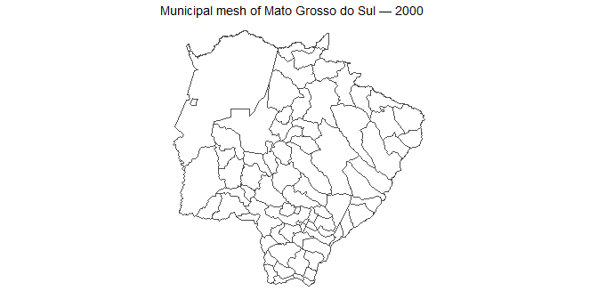
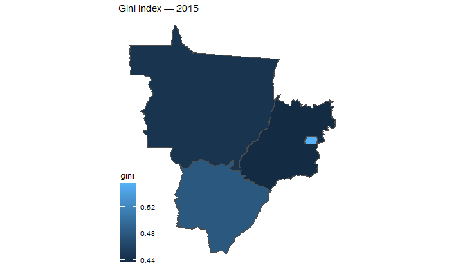

<!-- README.md is generated from README.Rmd. Please edit README.Rmd. -->

# brazilmaps

`brazilmaps` provides simplified Brazilian territorial meshes as local
`sf` objects. Spatial files are installed with the package: using a map
never triggers a download and does not require an internet connection.

Municipal meshes are bundled at milestones in the official IBGE archive.
Within each consecutive run with the same number of municipalities, the
package retains only the latest edition:

``` r
library(brazilmaps)
brmap_editions()[c("year", "n_features", "file_bytes")]
#>   year n_features file_bytes
#> 1 2000       5508     892060
#> 2 2001       5561     407870
#> 3 2007       5564     446056
#> 4 2010       5565    1675620
#> 5 2023       5570    1865714
#> 6 2025       5571    2071346
```

The current edition is the default. Select a historical edition with
`year`:

``` r
current <- get_brmap("municipality", filters = list(state = 50))
mesh_2000 <- get_brmap(
  "municipality", year = 2000, filters = list(state = 50)
)

plot_brmap(mesh_2000) +
  ggplot2::labs(title = "Municipal mesh of Mato Grosso do Sul — 2000")
```

<!-- -->

The meshes are simplified for thematic maps, exploratory analysis and
joins. They must not be used for cadastral work, legal boundary
decisions or precise area/perimeter measurement.

## Installation

Install the released version from CRAN:

``` r
install.packages("brazilmaps")
```

Or install the development version:

``` r
# install.packages("pak")
pak::pak("rpradosiqueira/brazilmaps")
```

## Geographic levels

``` r
states <- get_brmap("state")
immediate <- get_brmap(
  "immediate_region", filters = list(state = 26)
)
intermediary <- get_brmap("intermediate_region")
```

Available levels are Brazil, regions, states, immediate regions,
intermediate regions and municipalities. The package also retains:

- `microregion` and `mesoregion`, discontinued IBGE statistical
  divisions, for compatibility with historical data;
- `state_hex` and `state_region`, curated equal-shape state cartograms.

Earlier PascalCase level names remain accepted with deprecation
warnings. Returned spatial columns use explicit lower-snake-case names
such as `municipality_code`, `state_code`, `immediate_region_code` and
`state_abbreviation`.

## Filtering, joining and plotting

All filter conditions are combined with logical AND:

``` r
data("gini2015")

midwest_states <- get_brmap(
  "state",
  filters = list(region = 5)
)

plot_brmap(
  midwest_states,
  data = gini2015,
  by = c("state_code" = "cod"),
  fill_by = "gini"
) +
  ggplot2::labs(title = "Gini index — 2015")
```

<!-- -->

`join_brmap()` preserves `sf`, and `plot_brmap()` returns a regular
`ggplot` that can be extended with ggplot2 layers and scales.

## Territorial codes

``` r
get_dtb(code = c(1, 50, 5101837))
#>         code                   name        level abbreviation region_code
#> 6538 5101837 Boa Esperança do Norte municipality         <NA>           5
#> 6910       1                  Norte       region         <NA>           1
#> 6938      50     Mato Grosso do Sul        state           MS           5
#>       region_name state_code         state_name immediate_region_code
#> 6538 Centro-Oeste         51        Mato Grosso                510008
#> 6910        Norte         NA               <NA>                    NA
#> 6938 Centro-Oeste         50 Mato Grosso do Sul                    NA
#>      immediate_region_name intermediate_region_code intermediate_region_name
#> 6538               Sorriso                     5103                    Sinop
#> 6910                  <NA>                       NA                     <NA>
#> 6938                  <NA>                       NA                     <NA>
#>      municipality_code      municipality_name
#> 6538           5101837 Boa Esperança do Norte
#> 6910                NA                   <NA>
#> 6938                NA                   <NA>
head(get_dtb_levels(
  c("municipality", "state"),
  filters = list(state = 50)
))
#>      municipality_code municipality_name state_code         state_name
#> 6442           5000203        Água Clara         50 Mato Grosso do Sul
#> 6443           5000252       Alcinópolis         50 Mato Grosso do Sul
#> 6444           5000609           Amambai         50 Mato Grosso do Sul
#> 6445           5000708         Anastácio         50 Mato Grosso do Sul
#> 6446           5000807      Anaurilândia         50 Mato Grosso do Sul
#> 6447           5000856          Angélica         50 Mato Grosso do Sul
```

The installed DTB contains the current hierarchy, including 5,571
municipal units, 510 immediate regions and 133 intermediate regions.
When a historical municipal map is filtered by an immediate or
intermediate region, the current hierarchy is used for municipality
codes that still exist.

## Data provenance and maintenance

Municipal geometries come from the official [IBGE municipal mesh
archive](https://geoftp.ibge.gov.br/organizacao_do_territorio/malhas_territoriais/malhas_municipais/).
Current hierarchy data come from the official [IBGE Localities
API](https://servicodados.ibge.gov.br/api/docs/localidades). All
installed geometry uses SIRGAS 2000 (EPSG:4674).

Bundled data retain attribution to their source institutions. Package
code is distributed under GPL-3; detailed data provenance and
attribution are recorded in `inst/COPYRIGHTS`.

Downloads occur only in the maintainer scripts under `data-raw/`. Those
scripts standardize, simplify, rebuild topology, validate counts and
codes, test planar and spherical validity, and record checksums and
exact source URLs. Package users only read the resulting local files.
